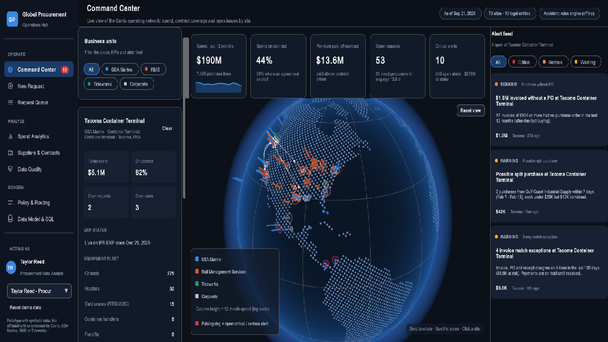

# Global Procurement Operations Hub

A Unity 6 prototype that turns decentralized purchase requests from a network of marine terminals, rail and intermodal operations, and a terminal-software company into standardized, traceable procurement decisions.

> I studied how Carrix's marine, rail and technology companies create procurement complexity, then built a prototype that converts decentralized requests into standardized, traceable procurement decisions.

**All data is synthetic.** Companies, sites, suppliers, contracts, prices and people are generated from a fixed seed for demonstration. This project is not affiliated with or endorsed by Carrix, SSA Marine, Rail Management Services or Tideworks Technology.




## Download and launch
Download the executable from this link: https://drive.google.com/file/d/1yOh0Lr8qGFXQCmLY7qG8WeNztDIOF50U/view?usp=drive_link
Unzip it and launch the "GlobalProcurementHub.exe" file.

Your work (submitted requests, approvals, merges, policy changes, and the persona you're acting as) is saved to `procurement-hub-state.json` in `Application.persistentDataPath`. To start over, click **Reset demo data** in the sidebar.

## What it does

| Screen | Purpose |
|---|---|
| **Command Center** | Dot-matrix 3D globe of about 70 sites. Each column's height shows 12-month spend, and its color shows the business unit. Pulsing rings mark critical or serious alerts. Click a site to see its profile (fleet, ERP status, top categories), with supplier-flow arcs drawn white for on-contract suppliers and amber for off-contract ones. KPIs and a live alert feed let you acknowledge or resolve alerts. |
| **New Request** | Intake form with a **live decision panel**. As you type, the hub classifies the need, evaluates the three engagement rules, routes the request to the category manager, builds the approval chain, suggests existing contracts, and benchmarks the price against network history. Eight one-click scenarios exercise each path. |
| **Request Queue** | Every request from intake to closed PO, with a lifecycle timeline, rule outcomes, stage actions (route, source, approve, receive, 3-way match, close, reject), emergency post-review, and a complete audit trail. |
| **Spend Analytics** | One normalized spend cube across entity, site, category and supplier. Includes monthly spend split into on-contract, off-contract and no-agreement; an entity × category heatmap; top suppliers rolled up across vendor records; and maintenance cost per crane or powered unit, benchmarked across sites. |
| **Suppliers & Contracts** | Golden supplier records with scorecards and the vendor-master fragments behind them (different names, IDs and systems per entity). Contracts show scope, utilization, price list and the leakage around each agreement. |
| **Data Quality** | Fuzzy vendor clustering with human-approved merges, and the legacy → IFS ERP migration over time. Unclassified legacy spend gets auto-classification suggestions, alongside 3-way match exceptions. |
| **Policy & Routing** | Editable engagement rules with a live impact preview on the request backlog, plus the delegation-of-authority matrix and the category → manager routing matrix. |
| **Data Model & SQL** | Relational schema (13 tables) and the PostgreSQL behind each metric, with live result previews. Exports `01_schema.sql`, `02_seed.sql`, `03_analytics_queries.sql` and `purchase_lines.csv`. |

### The three engagement rules (placeholders)

The official category poster wasn't available, so the rules are modeled on common practice and are editable in **Policy & Routing**:

1. **Spend threshold:** estimated value ≥ $25,000. Related spend at the same site and category within a look-back window also counts, which catches split purchases.
2. **Contractual commitment:** any contract, agreement, lease, SOW, subscription or supplier terms, regardless of value.
3. **New or non-approved supplier:** the supplier isn't in the vendor master, or isn't approved for the category (matched with fuzzy logic against every known alias).

**Emergencies** (equipment down, safety) proceed immediately and are queued for a procurement post-review within 48 h.

### Assistant with a human in the loop

The recommendation engine is deterministic and explainable. It shows what it checked, why it recommends what it does, the risks it sees, and a confidence score. Nothing is applied until a person clicks **Accept** or **Override** (with a reason), and every decision goes into the audit trail. If `ANTHROPIC_API_KEY` is set before launch, you can also ask Claude (`claude-opus-5`, via the Messages API) follow-up questions about a recommendation. It only explains; it never acts.

## How the data problem is simulated

- **10 legal entities** across SSA Marine (containers, conventional, cruise), RMS (PRS, RTS, TSS, PTRS, PRS Auto), Tideworks and Corporate. They go live on IFS ERP in phases, while earlier spend comes from legacy AP, site spreadsheets and P-cards.
- **About 15K purchase lines over 24 months**, driven by per-site-type demand profiles and a priced item catalog with about 100 items.
- **One supplier, many vendor records:** each entity and system creates its own record, with spellings like `PAC CRANE PTS INC - TACOMA`, typos and remit-to duplicates.
- **Realistic leakage:** contract compliance varies by entity, legacy system and urgency. Off-contract purchases carry a price premium, and some spend continues after an agreement expires.
- **Exceptions:** invoice and receipt mismatches, no-PO buying, split purchases, and unclassified legacy lines.

## Architecture

```
Assets/ProcurementHub/
  Scripts/Core/      Domain model, synthetic generator, rules & services (pure C#, unit-tested)
    Domain.cs  ReferenceData.cs  HubDatabase.cs      data model + deterministic generator
    VendorNormalizer.cs  CategoryClassifier.cs       fuzzy matching, explainable classification
    DecisionEngine.cs                                engagement rules, routing, contracts, pricing, recommendation
    AlertEngine.cs  Analytics.cs  Workflow.cs        alerts, spend cube, request lifecycle
    SqlExporter.cs                                   schema, seed data, analytic SQL
  Scripts/Globe/     Procedural dot-matrix globe, pins, arcs, orbit camera (renders to a RenderTexture)
  Scripts/UI/        UI Toolkit app shell, reusable controls (tables, charts), one class per page
  Shaders/           Single URP unlit shader (vertex color, fresnel rim, configurable blend)
  UI/                Hub.uss design system, runtime theme, PanelSettings
  Editor/            One-click scene/asset setup and player build
  Tests/Editor/      17 NUnit EditMode tests (rules, matching, classification, workflow, determinism)
```

- **Rendering:** UI Toolkit for every screen, with charts built from VisualElements and Painter2D. The globe renders into a RenderTexture that's shown inside the UI, so pointer events drive orbiting, zooming and picking.
- **Charts:** they follow a validated colorblind-safe categorical palette. Business-unit colors are consistent across the globe and the charts, and status colors are reserved for alerts.

## Tests

Run them from *Window → General → Test Runner → EditMode*, or from the CLI:

```bash
unity test "C:\Users\Arkad\Documents\Unity\SSA Marine Procurement" --mode EditMode
```
